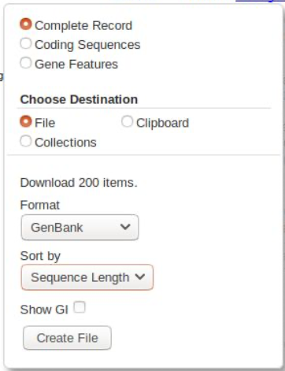

=============================================
Building Phylogenetic Trees for Metagenetics
=============================================

------------------------------------------
Introduction
------------------------------------------

Mitochondrial genomes allow us to build accurate phylogenetic trees of our references. These trees can be a powerful supplement to metagenomics in many ways:

* Inclusion of phylogenetic relationships for analysing ecological patterns in an evolutionary context

* More detailed identification of anonymous OTUs through placement within an established phylogenetic tree

Phylogenetic trees are more powerful when built with comprehensive data. Here we introduce a rapid and efficient pipeline for building a tree with our data. We supplement our mitogenomes with data from GenBank, then extract genes, align them, concatenate to a supermatrix and perform some fast tree building. This is not going to produce the best phylogeny! This is a general overview of the pipeline we use, the aim is to:

* For those without phylogenetics experience, present an introduction to outline and demystify the process of tree building

* For those with phylogenetics experience, hopefully introduce some novel techniques

------------------------------------------
Preparing mitogenome data
------------------------------------------

First, copy the set of novel Coleoptera mitogenomes from the canopy project to your directory (``/AMM/references/canopy_ColeopMT.gb``). This is the complete version of what you assembled in the last section.

We want to supplement these mitogenomes with some good data from GenBank in order to generate a more comprehensive tree. We will use mitogenome data from the NCBI RefSeq database. This database holds the set of best-curated sequences on GenBank.

While we will obviously want to acquire some Coleoptera data, we should also include representatives from other taxa. Most importantly, we want to be able to validate the assignment of OTUs to other Insect orders that we observed using our taxonomic assignment methods. Given that CO1 is a fast-evolving gene, and we are just using a short, highly variable region, we should not expect that deep-level (i.e. order-level) relationships will be properly resolved on a tree based solely on this data. In other words, we shouldn’t necessarily assume that the beetles and non-beetles will form separate monophyletic clades on a tree if only the metabarcode region is used to separate them. So, we will also use data for a set of other Arthropod orders. ​This data is all already downloaded to the server.

If you’ve not previously acquired data from GenBank, or aren’t familiar with the GenBank file format, we’ll quickly go over how we retrieved the Coleoptera data. There are many ways to get this data, the most efficient would be to use NCBI’s command line tools. However, we don’t want to run into issues with our server repeatedly accessing GenBank, so this is the easy way.

1. Go to the genbank nucleotide core database at `https://www.ncbi.nlm.nih.gov/nuccore <https://www.ncbi.nlm.nih.gov/nuccore>`_ 

2. In the search bar, type the following:
		
.. code-block:: rst 

	"Coleoptera"[Organism] AND srcdb_refseq[PROP] AND mitochondrion[filter]

We are asking for any sequences with Coleoptera in the Organism field, from the RefSeq database, and from the mitochondrion only. You should get 200 sequences. We will download all of these as a GenBank file - click on the ​Send to:​ link and select as follows:

Then click ​Create File​ and download it.

I strongly suggest you give this file a sensible name. It’s worth the keystrokes to name something accurately so you know what it is later. I would usually include that it’s from genbank, what the searchterms were, and the date, eg: “GBdl_RefSeq_ColeopMT_2019-10-04.gb”

The file we have just downloaded is a GenBank-format file. This contains sequence data, like a fasta file, but also contains annotations and features. Annotations are metadata about the sequence entry, such as the authors of the sequence, the taxonomy of the source specimen, and other information. Features are metadata about specific sections of the sequence data, such as genes. Features are often called annotations as well - indeed, generally if someone is talking about “annotating” a sequence they mean finding and marking up the gene regions in that sequence.

If the idea of gene features/annotations is new to you, you can visualise these by going back to our search results on GenBank. Choose a sequence, and below it you’ll see a ​Graphics link. Click this and it will load a visual representation of the Features on that record - you should be able to see how the different genes are laid out on this mitochondrion.

FYI, the search term we used for the non-Coleoptera was:

.. code-block:: rst

	("Blattodea"[Organism] OR "Hemiptera"[Organism] OR "Lepidoptera"[Organism] OR "Diptera"[Organism] OR "Araneae"[Organism] OR "Collembola"[Organism]) AND srcdb_refseq[PROP] AND mitochondrion[filter]

Copy to your directory the two files for the Coleoptera and selected other Arthropods (Blattodea, Hemiptera, Lepidoptera, Diptera, Araneae, and Collembola):

.. code-block:: bash 

	$ cp /AMM/references/GBdl_RefSeq_ColeopMT_2019-09-20.gb ./
	$ cp /AMM/references/GBdl_RefSeq_OtherArthMT_2019-09-20.gb ./

For speed, we’re just assuming this data is perfect and completely suitable for our purposes. If approaching this comprehensively, we would check through the sequences to ensure that:

* All of the sequences come from species within the group we’re interested in

* All of the annotations are accurate

We are going to remove some redundancy in these datasets, since in total we now have over 1,400 references. Not only will building trees with this many sequences be very time-consuming, but it’ll make our trees very complicated to view and understand. We are going to reduce our dataset by taking representatives from each family in our references - three per family for the Coleoptera, one per family for everything else.

We’ll run a custom script that loads the entries, sorts them by a specified taxonomic level, and outputs a specified number of entries from each group. It is imaginatively named “subset_gb_by_taxonomy.pl”. Check out the helpfile if you wish, the commands we need are:

.. code-block:: bash 

	$ subset_gb_by_taxonomy.pl -g GBdl_RefSeq_OtherArthMT_2019-09-20.gb -t family -n 1 -random -o GBdl_RefSeq_OtherArthMT_1pfamily
	$ subset_gb_by_taxonomy.pl -g GBdl_RefSeq_ColeopMT_2019-09-20.gb -t family -i -n 3 -random -o GBdl_RefSeq_ColeopMT_3pfamily

Note the ``-i`` in the second command - this ensures we include families that have fewer than three representatives. You may get some messages about “trouble dissecting...” - you can ignore these. For each command you should get 2-4 files - the one we want is the one with _subset in the name. Concatenate the two _subset files into a single file.

------------------------------------------
Extracting protein coding genes
------------------------------------------

We are going to focus solely on protein coding genes, rather than using the full mitochondrial DNA sequence of all of our records. GenBank-format files contains data that tells us the location of all of the genes present on the DNA sequence for each entry. If you’re not familiar with this concept already, see above, because otherwise what we’re doing here will not make any sense to you.

We will use a custom script to extract the 13 mitochondrial protein coding genes from our subsetted genbank file, because it’s quick and easy. You can see the help file of this script as follows:

.. code-block:: bash

	$ extract_genes.pl -h

Replace the italics parts in the following command with the appropriate file and directory names and run it. Make sure you match up the arguments with the help file and understand what you’re doing here! The *outdir* will hold a file for each gene. You don’t need to create this, the script will

..code-block:: bash

	$ extract_genes.pl -g ​novelmt.gb genbankmt.gb ​-o ​outdir/​ -minregion 10

You may get some errors about some of the GenBank genes not having enough CDS features. Don’t worry, it’s because these files for some reason don’t have proper feature tags. We can forget about these sequences - we have plenty!

Once complete, you should see thirteen files in your output folder, one for each gene. Check the number of sequences in each.

* Is it the same?

* Why might it not be the same?

I should note that this script is a very rigid solution. There is no standard format for gene names in GenBank, so our sequences use many different variants for the same gene: e.g. cox1, co1, coi, etc. The script is hardcoded to recognise as many variants as I have seen, but if you were to use this script on your own data, it might miss a gene if it had a different name. The more common approach to this task is to manually extract the sequences using a GUI tool such as Geneious, but we have not done this for several reasons:

* It’s slow and boring, we prefer automated tools

* Geneious is not free

* Manual processes frequently introduce errors into sequence naming

------------------------------------------
Aligning protein coding genes
------------------------------------------

The sequences for each gene need to be aligned so that comparable regions are lined up. In phylogenetic terms, this means we need to ensure that the positions used for tree inference are homologous.

We will do a quick alignment using MAFFT for each gene, using the FFT-NS-2 method. First, make a directory to store your aligned genes.

Run the following command, making sure to replace *raw* with the name of the directory you extracted your genes into in the last step and ​new​ with the name of your new directory:

.. code-block:: bash 

	$ for f in ​dir​/*; do mafft --thread 1 --retree 2 --maxiterate 0 $f >​ new/​${f#*/}; done

While this is running, have a look at the manual for mafft `https://mafft.cbrc.jp/alignment/software/manual/manual.html <https://mafft.cbrc.jp/alignment/software/manual/manual.html>`_. Have a look at the different methods for alignment and think about what might be best for these genes.

Once it’s complete, pick one of your alignments and download it to your computer. Use an alignment viewer, such as AliView, to open the alignment.

* How does it look? Is the reading frame maintained?

* Are all of the start and stop codons present and complete for all sequences, are they at the beginning or end of the sequences, and are they aligned properly? What might it mean if they aren’t?
 
* Are there any sequences that look very out of place. If there were, what could this mean?

Sequence alignment is a big topic, beyond the scope of this course. There is a wide range of software out there: two other commonly-used alignment tools are MUSCLE and CLUSTAL. We find MAFFT to be very versatile and fast for all sorts of alignment tasks. If doing this with your own data, you would generally try to optimise the gap opening parameters for each gene in order to generate an optimum alignment, and you might manually edit your alignment. Manual editing is used to remove sequencing errors, correct obvious misalignments and most importantly to check start/stop codons and ensure that codon positions are correctly maintained across the alignment.

------------------------------------------
Concatenating alignments
------------------------------------------

For phylogeny we need to consolidate our genetic data into one file with all of the data for each original sequence. We concatenate the 13 gene files to form a superalignment comprising all of our sequences. This is also known as a supermatrix, since every sequence is now the same length and thus each base is a cell in a very large table, where the rows are different source specimens and the columns are base positions. It is this data that phylogenetic reconstruction will work on.

We use the ​catfasta2phyml.pl command to concatenate the aligned files into a supermatrix. It is available at `https://github.com/nylander/catfasta2phyml <https://github.com/nylander/catfasta2phyml>`_. It’s already on the server, you don’t need to download it. As always, check out the helpfile. We want to force concatenation of all files even when number of taxa differ, and we want to output a fasta. See if you can figure out the command, then run it.

------------------------------------------
Tree building
------------------------------------------

We can now use our supermatrix to build a phylogeny. Here we will be using FastTree to quickly generate a tree, since this is (unsurprisingly) fast. This is an “approximately maximum likelihood” phylogenetic tree building method, broadly similar in method to PhyML or RAxML.

Use the following command, using the output from the previous step as the input and choosing an appropriate name for your tree. The ``-gtr`` option tells FastTree to use the GTR+CAT model, and the ``-nt`` option specifies that this is DNA data.

.. code-block:: bash 

	$ FastTree -gtr -nt < ​supermatrix.fasta​ > ​tree.nwk

The algorithm generates a newick file, which is the most common format for phylogenetic trees. This is a plain text format, you can view the file using the ``head`` command. Each terminal in the tree has the ID of the sequence used to generate it. These code names are very useful for linking to data about our sequences, but aren’t helpful for examining the tree and interrogating its success.

In this case, we’ll use a script to pull metadata from the GenBank files to do the renaming. Again, this is a custom script used to skip over tedious bits of this pipeline, it’s definitely not a required step.

The script is ``rename_newick_with_gb.pl``, check out the helpfile using ``-h`` and rename the tree with the fields you think would be useful. My suggestion is in the footnote.

------------------------------------------
OTU trees
------------------------------------------

Before we look at this mitogenome tree, let’s quickly build a tree for the OTUs as well, and then we can compare the two. Unlike with the references, we’re not going to align our OTUs since they’re all the same length anyway - essentially an alignment.

Take your OTUs and build a tree with them using FastTree. 

A tree with anonymous “otuXXX” labels isn’t very easy to interrogate. It would be useful if we could rename the terminals with data from our classifiers to see how the classifications line up with the topology of the tree. We have prepared a custom script to do just that. Run the following command, as always replacing the parts in italics with the appropriate files.

.. code-block:: bash 

	$ rename_newick_with_classifiers.pl -tree ​tree.nwk​ -out ​out.nwk ​\ 
	> -taxa order family -stringpos 9 20 \
	> -sintax ​sintax.txt​ -rdp ​rdp.txt​ -megan ​megan.txt

If you’re interested in what these terms mean, check out the helpfile, but this another very rigid tool that we’re just using to get past some boring steps quickly.

------------------------------------------
Tree viewing
------------------------------------------

Download both of these trees to your computer and open them using FigTree, Dendroscope or similar to view the tree.

We know these trees aren’t going to be perfect because we’ve used a very fast method to get here, without tweaking alignments or tree-building methods. This is a good chance to look for features of trees that aren’t quite right:

* Check to see whether, in general, the taxonomy of your terminals matches the clade structure of the tree

* Check to see whether there are very long branches

* Are there any very long branches? Why might this be?

* Are the OTUs placed as expected based on the taxonomic assignments?

Are there substantial differences between the trees? Which looks better?

Remember, the taxonomic assignments of the OTUs are not certain, so we shouldn’t really base our assessment of this tree’s accuracy on them.

Keep the trees up. We will discuss them as a group when everyone’s at this stage.

Now that we’ve learned a quick method of building trees, we can use this knowledge to compare our OTUs from different methods.

First, let’s create a folder for this little side project, just to be organised

Second, we need to create copies of our OTU files with names added to the headers in order to differentiate OTUs from different methods. For each OTU file, run the following command, replacing method with a description of the method used to create OTUS, e.g. “clus3pc” (text or numbers only, no spaces or other characters!):

.. code-block:: bash 

	$ sed -e “s/\(^>.*$\)/\1method/” file > newfolder/file

Next, concatenate these OTU files into one file - you’ll need to be inside your new folder for this:

.. code-block:: bash 

	$ cat * > allotus.fasta

You can now run FastTree on this file and look at how different OTUs match up.
	

